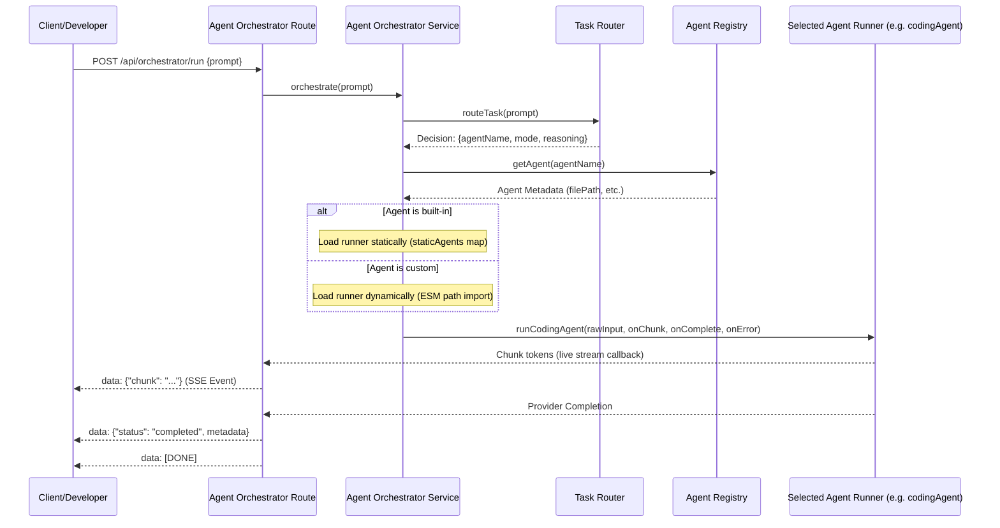

# Agent Orchestrator Module

The **Agent Orchestrator** module is the primary execution interface of `devpilot-ai`. It provides a single API endpoint that receives raw developer requests, passes them to the [Task Router](file:///C:/Users/deviv/devpilot-ai/docs/taskRouter.md) to classify intent, looks up target agent specifications, invokes the selected agent dynamically, and streams generated text chunks back using Server-Sent Events (SSE).

---

## Architecture Flow

The sequence diagram below displays how the Agent Orchestrator coordinates tasks dynamically:



---

## API References

### Endpoint
* **URI**: `POST /api/orchestrator/run`
* **Format**: Server-Sent Events (`text/event-stream`)

### Payload Example
```json
{
  "prompt": "write a node function that fetches weather from an api",
  "forceRules": false,
  "language": "javascript"
}
```

* **`prompt`** (String, Required): The user instruction or question.
* **`forceRules`** (Boolean, Optional): If `true`, forces rule-based classification in the Task Router.
* **`...params`** (Any, Optional): All other parameters (like `filePath`, `language`, `repository`) are forwarded to the selected agent runner.

---

## Success Completion Metadata

When the selected agent finishes execution, the orchestrator streams final metadata before sending the `[DONE]` indicator:

```json
{
  "status": "completed",
  "metadata": {
    "agentName": "codingAgent",
    "mode": "generate",
    "provider": "gemini",
    "reasoning": "Reason why codingAgent was matched."
  }
}
```
This metadata is crucial for frontend applications to identify which agent resolved their request.
