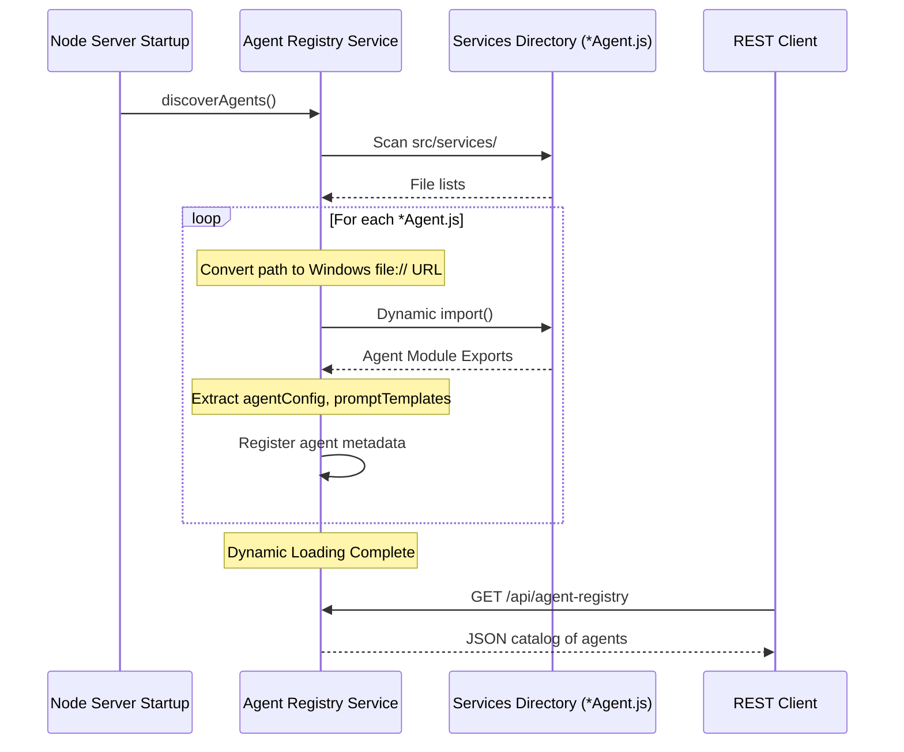

# Agent Registry Module

The **Agent Registry** module is a core discovery and catalog service within `devpilot-ai` designed to map, query, and dynamically manage available AI Agents. It scans files at startup, loads their exported metadata configs, resolves mode keys, and registers custom agents.

---

## Architecture Flow

The sequence diagram below displays how the Agent Registry dynamically discovers other agents on server boot and returns summaries to clients:



---

## API Specifications

### Base URL
* `/api/agent-registry`

### 1. `GET /`
Lists all registered agents and their configuration metadata.
* **Response**:
  ```json
  [
    {
      "name": "codingAgent",
      "description": "DevPilot AI coding agent.",
      "defaultProvider": "gemini",
      "fallbackProviders": ["openai", "anthropic"],
      "maxRetries": 3,
      "temperature": 0.3,
      "modes": ["generate", "refactor", "explain", "generate_tests"],
      "filePath": "codingAgent.js",
      "isDynamic": true
    }
  ]
  ```

### 2. `GET /:name`
Returns configuration details for a single agent. Returns `404` if the name is unrecognized.
* **Response**:
  ```json
  {
    "name": "codingAgent",
    "description": "DevPilot AI coding agent.",
    "defaultProvider": "gemini",
    "fallbackProviders": ["openai", "anthropic"],
    "maxRetries": 3,
    "temperature": 0.3,
    "modes": ["generate", "refactor", "explain", "generate_tests"],
    "filePath": "codingAgent.js",
    "isDynamic": true
  }
  ```

### 3. `POST /register`
Manually registers a custom agent in the store.
* **Headers**: `Content-Type: application/json`
* **Request Body**:
  ```json
  {
    "name": "sqlAgent",
    "description": "Custom query optimization assistant.",
    "defaultProvider": "openai",
    "modes": ["optimize", "explain"]
  }
  ```
* **Response**:
  ```json
  {
    "status": "success",
    "agent": {
      "name": "sqlAgent",
      "description": "Custom query optimization assistant.",
      "defaultProvider": "openai",
      "fallbackProviders": ["openai", "anthropic"],
      "maxRetries": 3,
      "temperature": 0.3,
      "modes": ["optimize", "explain"],
      "filePath": null,
      "isDynamic": false
    }
  }
  ```

### 4. `POST /discover`
Forces a manual reload of the services directory discovery scan.
* **Response**:
  ```json
  {
    "status": "success",
    "agents": [ ... ]
  }
  ```
