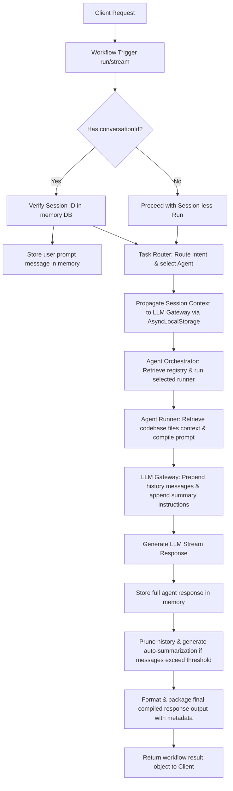

# End-to-End Agent Workflow Module

The End-to-End Agent Workflow module connects and coordinates all core services in `devpilot-ai` (`taskRouter`, `agentOrchestrator`, `conversationMemory`, and specific AI Agents) into a single, cohesive developer pipeline. It exposes endpoints that can either stream response chunks dynamically or wait to return a fully packaged JSON response containing both execution outputs and routing metadata.

---

## Workflow Sequencing Lifecycle



---

## Service API (`src/services/agentWorkflow.js`)

### `runWorkflow(payload, onChunk)`
Executes the unified end-to-end pipeline.
- **Parameters**:
  - `payload` (Object):
    - `prompt` (string, required): The instruction command text.
    - `conversationId` (string, optional): Session database reference ID.
    - `forceRules` (boolean, optional): Overrides dynamic routing with strict compliance rules.
  - `onChunk` (Function, optional): SSE chunk callback function.
- **Returns**: Promise resolving to:
  ```json
  {
    "status": "success",
    "conversationId": "uuid-string-or-null",
    "agentName": "codingAgent",
    "mode": "generate",
    "provider": "gemini",
    "reasoning": "intent classification details",
    "messagesCount": 4,
    "output": "The compiled complete response text output."
  }
  ```

---

## REST Endpoints

### 1. `POST /api/workflow/run`
Run the workflow synchronously. Blocks execution until completion and returns the final packaged JSON response.
- **Payload**:
  ```json
  {
    "prompt": "write a javascript quicksort helper",
    "conversationId": "30455e37-b0ad-4b8c-9e04-f3f2230fa9b1"
  }
  ```
- **Response**:
  ```json
  {
    "status": "success",
    "conversationId": "30455e37-b0ad-4b8c-9e04-f3f2230fa9b1",
    "agentName": "codingAgent",
    "mode": "generate",
    "provider": "gemini",
    "reasoning": "matches coding agent request",
    "messagesCount": 2,
    "output": "{\"code\":\"function quicksort(arr) {...}\",\"explanation\":\"quicksort utility...\",\"bestPractices\":\"...\"}"
  }
  ```

### 2. `POST /api/workflow/stream`
Run the workflow asynchronously streaming response chunks via Server-Sent Events (SSE). Writes the final completed metadata package at the end of the event stream before sending the `[DONE]` message.
- **Payload**: Same as synchronous run.
- **SSE Stream Sequence**:
  ```
  data: {"chunk":"function"}
  
  data: {"chunk":" quicksort"}
  
  data: {"status":"completed","metadata":{"status":"success","conversationId":"...","agentName":"codingAgent","provider":"gemini","messagesCount":2,"output":"..."}}
  
  data: [DONE]
  ```
