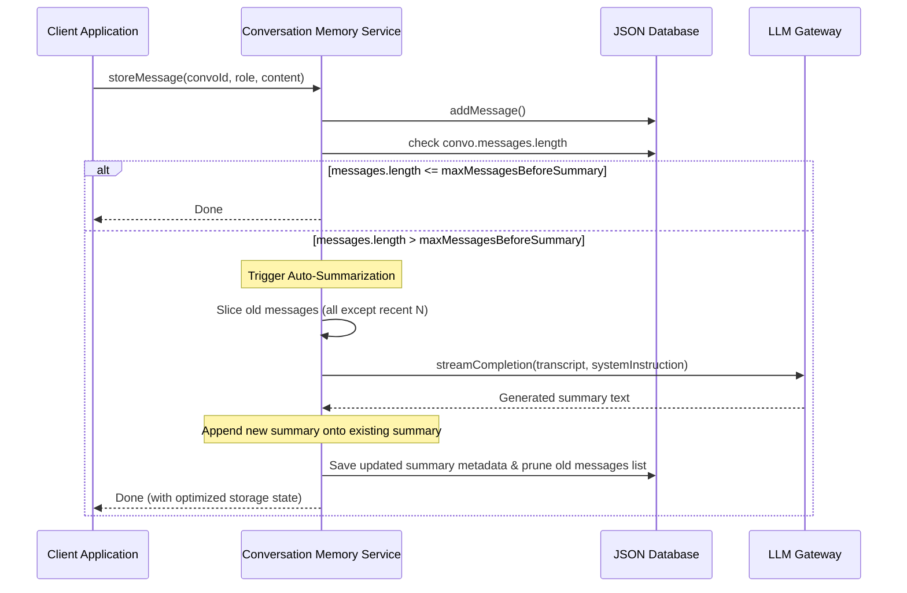

# Conversation Memory Module

The **Conversation Memory** module is a core component within `devpilot-ai` designed to optimize LLM interactions over long, multi-turn conversations. It prevents token-limit exhaustion by automatically compressing older dialogue loops into concise metadata summaries, ensuring developers can run extended workflows without losing context.

---

## Token Optimization Workflow

The diagram below details how the Conversation Memory module monitors dialogue bounds and calls the LLM Gateway to compress old message contexts:



---

## Technical Specifications

### Memory Parameters
These constraints reside inside `src/services/conversationMemory.js`:

* **`maxMessagesBeforeSummary`** (Default: `10`): The total number of messages kept in active memory. Exceeding this triggers summarization.
* **`keepRecentMessagesCount`** (Default: `4`): The number of recent messages kept as live context after summarization completes.

---

## API Documentation

### 1. `POST /api/memory/message`
Stores a message and runs the trimming algorithms.
* **Headers**: `Content-Type: application/json`
* **Request Body**:
  ```json
  {
    "conversationId": "convo-123",
    "role": "user",
    "content": "Add a new module to the server."
  }
  ```
* **Response**:
  ```json
  {
    "status": "success",
    "message": {
      "id": "msg-uuid",
      "role": "user",
      "content": "Add a new module to the server.",
      "timestamp": "2026-06-24T12:00:00.000Z"
    }
  }
  ```

### 2. `GET /api/memory/context/:conversationId`
Retrieves optimized dialogue history.
* **Response**:
  ```json
  {
    "systemPromptExtension": "Previous Conversation Summary:\nUser asked to initialize a node application...",
    "messages": [
      { "role": "user", "content": "Keep doing that." },
      { "role": "model", "content": "Understood." }
    ]
  }
  ```

### 3. `POST /api/memory/summarize/:conversationId`
Forces a manual summarization.
* **Response**:
  ```json
  {
    "status": "success",
    "message": "Conversation summarized successfully."
  }
  ```

### 4. `DELETE /api/memory/clear/:conversationId`
Wipes the conversation messages list and metadata summary.
* **Response**:
  ```json
  {
    "status": "success",
    "message": "Conversation memory cleared."
  }
  ```
