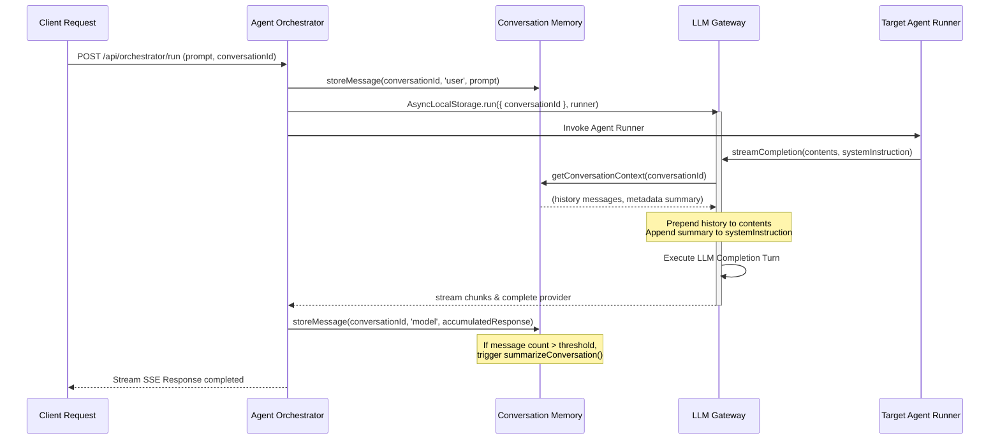

# Memory Integration Module

Memory Integration links the Conversation Memory module to all agents in `devpilot-ai`. It provides seamless context retrieval, dialogue interaction logging, and automated history summarization without modifying individual agent files.

---

## Architecture Design & Flow

---

## Technical Features

1. **Implicit Context Propagation (`AsyncLocalStorage`)**:
   - Instead of passing `conversationId` parameters through all inner functions of every agent, the orchestrator sets up an execution context store using Node's `AsyncLocalStorage`.
   - The `llmGateway` service checks the store at runtime, automatically fetching and appending conversation history to outgoing messages.

2. **Automated Interaction Logging**:
   - When a user sends a prompt via orchestration, it is stored in the database immediately as a `user` role message.
   - When the agent finishes streaming its response, the orchestrator accumulates all pieces and logs the final result as a `model` role message.

3. **Context Injection Rules**:
   - **Dialogue history**: Loaded past messages are mapped to LLM format and prepended. The very last message is sliced off during prepending, as it is replaced by the agent's active compiled prompt (preventing duplication).
   - **Conversation summary**: Saved summaries are retrieved from metadata and appended to system instructions.

4. **Lifecycle Summarization**:
   - Every message storage call triggers a check. If the length exceeds limits (e.g. 10 messages), the memory manager automatically invokes LLM generation to summarize old dialogues and prunes message arrays to preserve context limits.

---

## Key Files & Modules

* **[src/services/llmGateway.js](file:///C:/Users/deviv/devpilot-ai/src/services/llmGateway.js)**: Declares `memoryStorage` context and performs context injection in `streamCompletion`.
* **[src/services/agentOrchestrator.js](file:///C:/Users/deviv/devpilot-ai/src/services/agentOrchestrator.js)**: Stores inputs/outputs and executes agent runners inside the storage scope.
* **[src/services/conversationMemory.js](file:///C:/Users/deviv/devpilot-ai/src/services/conversationMemory.js)**: Manages database transactions, retrieves formatted histories, and coordinates summarization hooks.
* **[tests/memoryIntegration.test.js](file:///C:/Users/deviv/devpilot-ai/tests/memoryIntegration.test.js)**: Holds test coverage validating context mapping, data persistence, and auto-summarize thresholds.
