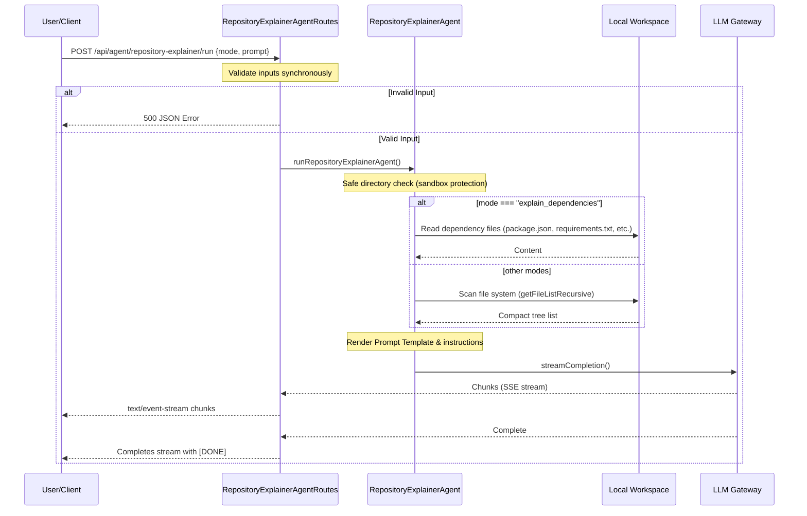

# Repository Explainer Agent

The **Repository Explainer Agent** is a dedicated service within `devpilot-ai` designed to provide deep structural, architectural, module-level, and dependency analysis for repositories. It helps engineers and tools quickly inspect codebases, understand directory layouts, identify execution flow entry points, and unpack third-party package dependencies.

---

## Architecture Flow

The following diagram illustrates how the Repository Explainer Agent constructs its analysis prompt by querying local project configuration templates and directory contents:



---

## Key Responsibilities & Modes

The agent exposes six modes, each responding with a strictly typed JSON output:

```json
{
  "explanation": "Markdown description details here...",
  "summary": "Short 1-2 sentence high-level summary."
}
```

### 1. `explain_folder_structure`
Analyzes recursive file lists of the targeted directory up to depth 3 (excluding `.git`, `node_modules`, and cached folders) and generates layout explanations.

### 2. `explain_architecture`
Explains high-level patterns (MVC, Clean Architecture, Server-Router-Service layouts) using file structure lists combined with root-level configuration files.

### 3. `summarize_repo`
Generates a comprehensive summary of what the repository does, what functions it implements, and its engineering focus.

### 4. `describe_modules`
Identifies logical services, router modules, databases, or key scripts, and describes their individual scope and roles.

### 5. `identify_entry_points`
Locates files responsible for launching processes, building scripts, server binds, or command handlers (e.g. `server.js`, `app.js`, `main.py`).

### 6. `explain_dependencies`
Reads standard dependency registries (e.g., `package.json`, `requirements.txt`, `Cargo.toml`, etc.) and outlines the purpose of installed libraries.

---

## API Reference

### Endpoint
* **URI**: `POST /api/agent/repository-explainer/run`
* **Format**: Server-Sent Events (`text/event-stream`)

### Payload Example
```json
{
  "mode": "explain_dependencies",
  "prompt": "List the database libraries used by this repository.",
  "repoName": "optional-cloned-repo-name"
}
```

* **`mode`** (String, Required): One of:
  * `explain_folder_structure`
  * `explain_architecture`
  * `summarize_repo`
  * `describe_modules`
  * `identify_entry_points`
  * `explain_dependencies`
* **`prompt`** (String, Required): The raw prompt/instruction that you want answered.
* **`repoName`** (String, Optional): Target repository cached in `cloned_repos`. If omitted, analyzes the active workspace.
