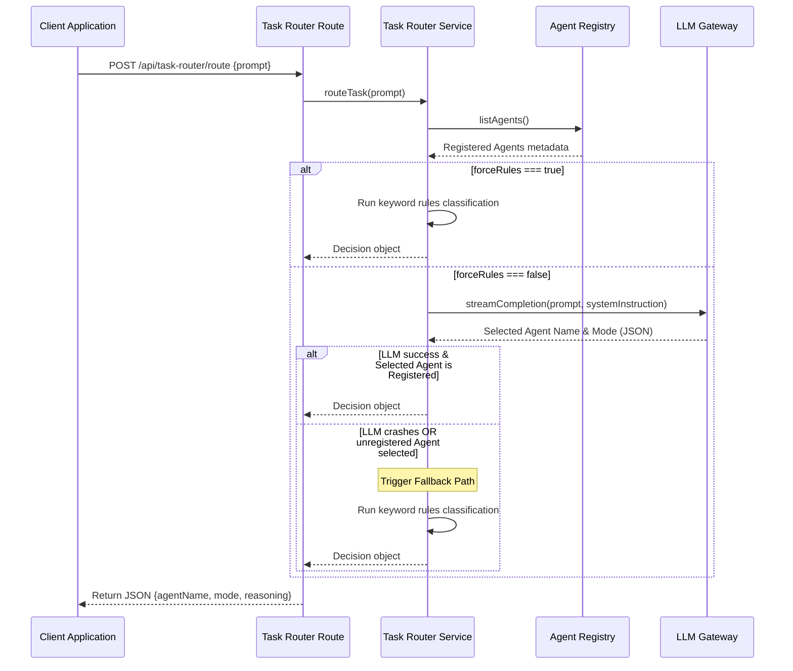

# Task Router Module

The **Task Router** module is the central request dispatcher of `devpilot-ai`. It analyzes user prompts and queries the [Agent Registry](file:///C:/Users/deviv/devpilot-ai/docs/agentRegistry.md) dynamically to delegate user intent tasks to the single most appropriate agent (e.g. Coding Agent, Debugger Agent, Terminal Assistant, etc.) and matching mode.

---

## Dispatch Sequence Flow

The following workflow diagram shows how the Task Router analyzes prompt intents and routes them dynamically using a two-tier evaluation system (LLM classification with Rule-based keywords fallback):



---

## Routing Modes and Fallbacks

### 1. LLM Classification (Tier 1)
Prepares a prompt containing all currently registered agent configurations, descriptions, and modes in the registry, instructing the model to return a structured JSON mapping:
```json
{
  "agentName": "codingAgent",
  "mode": "refactor",
  "reasoning": "User prompt requests function optimization which maps to refactor."
}
```

### 2. Rule-Based Classification (Tier 2 / Fallback)
If the LLM classifier is unavailable, timed out, or selects an unrecognized agent, a deterministic regex/keyword parser runs immediately to match queries:
* **Prompt Optimizer Agent**: Matches `prompt`, `optimizer`, `rewrite`, `simplify`.
* **Pull Request Review Agent**: Matches `pr`, `pull request`, `review`, `diff`.
* **Terminal Assistant Agent**: Matches `terminal`, `shell`, `docker`, `git command`.
* **Debugger Agent**: Matches `debug`, `error`, `exception`, `crash`, `stack`.
* **Repository Explainer Agent**: Matches `folder`, `structure`, `architecture`, `dependency`, `entry point`.
* **Documentation Agent**: Matches `documentation`, `readme`, `comments`, `docstring`.
* **Planning Agent**: Matches `plan`, `milestone`, `roadmap`, `task`.
* **Coding Agent**: Default fallback for generic coding questions.

---

## API References

### Endpoint
* **URI**: `POST /api/task-router/route`
* **Format**: `application/json`

### Payload Example
```json
{
  "prompt": "explain terminal docker logs commands",
  "forceRules": false
}
```

* **`prompt`** (String, Required): The user instruction or question.
* **`forceRules`** (Boolean, Optional): If `true`, bypasses LLM evaluations entirely and immediately runs rule-based classification.

### Success Response (200 OK)
```json
{
  "agentName": "terminalAssistantAgent",
  "mode": "generate_command",
  "reasoning": "Rule-based match for terminal/shell/docker/git keywords."
}
```

### Error Response (400 Bad Request)
```json
{
  "error": "Missing required parameter: prompt."
}
```
